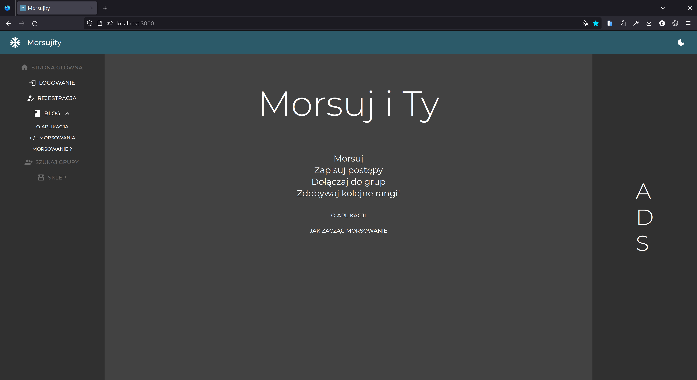

# Morsujity Client

ENGLISH VERSION [HERE](#table-of-contents)

## Spis treści

- [Morsujity Client](#morsujity-client)
  - [Spis treści](#spis-treści)
  - [Opis](#opis)
  - [Funkcjonalności](#funkcjonalności)
  - [Technologie](#technologie)
  - [Wygląd - zrzuty ekranu oraz gify](#wygląd)
  - [Instalacja krok po kroku](#instalacja-krok-po-kroku)
    - [Wymagania wstępne](#wymagania-wstępne)
    - [Instalacja](#instalacja)

## Opis

**[Demo na żywo](https://morsujity.com)**

Projekt "Morsujity Client" to strona internetowa, która umożliwia użytkownikom tworzenie konta oraz logowanie do głównej aplikacji. Odwiedzający mogą przeczytać bloga na temat "o aplikacji" oraz "przewodnik dla początkujących. Jak rozpocząć morsowanie". Aplikacja jest hostowana na `Google Cloud App Engine` pod adresem 'morsujity.com' i korzysta z zabezpieczeń dostarczanych przez `CloudFlare`. Dodatkowo, wprowadza obsługę błędów za pomocą biblioteki `Formik` i `Yup` oraz umożliwia potwierdzanie konta i zmianę hasła poprzez wiadomości e-mail. Interfejs użytkownika jest responsywny i oparty na bibliotece `Material UI`, co zapewnia estetyczny i intuicyjny wygląd.

## Funkcjonalności

- rejestracja
  - walidacja danych - `Formik` + `Yup` [przykład](#wygląd)
  - w przypadku błędu; odpowiednia wiadomość co zostało wprowadzone niepoprawnie
- logowanie
  - walidacja danych - `Formik` + `Yup`
  - w przypadku błędu; odpowiednia wiadomość co zostało wprowadzone niepoprawnie
  - auto-logownie (ciasteczko istnieje)
- blog
  - O aplikacji
  - Jak zacząć morsowanie. Poradnik dla początkujących
- autoryzacja
  - potwierdzenie e-mail
  - zmiana hasła użytkownika
- Wygląd
  - `Material UI`
  - `React hot toast`

## Technologie

| `Node`       |     `Material UI` |
| :----------- | ----------------: |
| `Next`       |          `Formik` |
| `React`      |             `Yup` |
| `Typescript` | `React hot toast` |
| `envalid`    |       `js-cookie` |

## Wygląd

<details>
<summary>Kliknij mnie</summary>

### Strona główna



### Logowanie


### Rejestracja


### Walidacja


### Potwierdzenie konta


### Blog


</details>

## Instalacja krok po kroku

### Wymagania wstępne

- [Zainstaluj Node.js](https://morsujity.com)
- uruchom API (morsujity_backend - [link do projektu](https://github.com/jakubmarchwiany/morsujity_backend))

### Instalacja

```bash
# Sklonuj repozytorium
git clone https://github.com/your-username/your-repo.git

# Zainstaluj pakiety
npm install

# wejdź do głównego folderu
cd morsujity_client
```

stwórz plik `.env.development` w folderze głównym

#### .env.development

```bash
# development
NEXT_PUBLIC_ENV=development
NEXT_PUBLIC_USER_APP_URL=http://localhost:4000
NEXT_PUBLIC_BACKEND_URL=http://localhost:8080
```

następnie, uruchom:

```bash
npm run dev
```

# English Version

## Table of Contents

- [Morsujity Client](#morsujity-client)
  - [Table of Contents](#table-of-contents)
  - [Description](#description)
  - [Features](#features)
  - [Technologies](#technologies)
  - [Design - screenshot and gifs](#design)
  - [Getting Started](#getting-started)
    - [Prerequisites](#prerequisites)
    - [Installation](#installation)

## Description

**[Live Demo](https://morsujity.com)**

The "Morsujity Client" project is a website that allows users to create accounts and log in to the main application. Visitors can read a blog about "the application" and a "beginner's guide on how to start cold-water swimming." The application is hosted on `Google Cloud App Engine` at the address 'morsujity.com' and uses security provided by `CloudFlare`. Additionally, it handles errors using the `Formik` and `Yup` libraries and allows account confirmation and password reset through email messages. The user interface is responsive and based on the `Material UI` library, providing an aesthetic and intuitive look.

## Features

- Registration
  - Data validation - `Formik` + `Yup`
  - In case of an error, provides a relevant message indicating what was entered incorrectly
- Login
  - Data validation - `Formik` + `Yup`
  - In case of an error, provides a relevant message indicating what was entered incorrectly
  - Auto-login (cookie exists)
- Blog
  - About the application
  - How to start cold-water swimming. Beginner's guide
- Authorization
  - Email confirmation
  - User password change
- Appearance
  - `Material UI`
  - `React hot toast`

## Technologies

| `Node`       |     `Material UI` |
| :----------- | ----------------: |
| `Next`       |          `Formik` |
| `React`      |             `Yup` |
| `Typescript` | `React hot toast` |
| `envalid`    |       `js-cookie` |

## Design

<details>
<summary>Click me</summary>

### Main Page


### Login


### Register


### Validation


### Account confirm


### Blog


</details>

## Getting Started

### Prerequisites

- [Install Node.js](https://morsujity.com)
- Run the API (morsujity_backend - [link to the project](https://github.com/jakubmarchwiany/morsujity_backend))

### Installation

```bash
# Clone the repository
git clone https://github.com/your-username/your-repo.git

# Install packages
npm install

# Navigate to the main folder
cd morsujity_client
```

Create a `.env.development` file in the main folder

#### .env.development

```bash
# development
NEXT_PUBLIC_ENV=development
NEXT_PUBLIC_USER_APP_URL=http://localhost:4000
NEXT_PUBLIC_BACKEND_URL=http://localhost:8080
```

Then, run:

```bash
npm run dev
```
